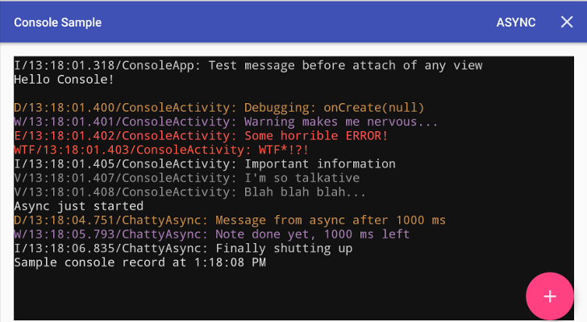

# Console
An Android console view, which allows you to log text using static calls, to easily debug your application, whilst avoiding memory leaks.

[](https://drive.google.com/file/d/0B0T1YjC17C-rTDBWNDBaSWVhcjg/view?usp=sharing)
[ ](https://github.com/jraska/Console/blob/master/LICENSE)
[](https://android-arsenal.com/details/1/3948)



## Usage

Include Console anywhere in your layout:

```xml
<com.jraska.console.Console
        android:layout_width="match_parent"
        android:layout_height="match_parent" />
```

then write to it:

```java
// Writing to console
Console.write("This is cool")
Console.writeLine("More cool")
// Clear it
Console.clear()
```

## Download

Grab via Gradle: 
```groovy
implementation 'com.jraska:console:1.2.0'
```

## Timber Tree
To allow easy integration with [Timber]

### Usage
```java
// In your Application or wherever you register your trees
Timber.plant(ConsoleTree())

// This will be written to your in-app console view
Timber.d("Hello Console")

// In case you want to customize
val consoleTree = ConsoleTree.Builder()
        .debugColor(Color.GRAY)
        // ...
        .build()
Timber.plant(consoleTree)
```

### Gradle: 
```groovy
implementation 'com.jraska:console-timber-tree:1.2.0'
```

## License

    Copyright 2015 Josef Raska

    Licensed under the Apache License, Version 2.0 (the "License");
    you may not use this file except in compliance with the License.
    You may obtain a copy of the License at

       http://www.apache.org/licenses/LICENSE-2.0

    Unless required by applicable law or agreed to in writing, software
    distributed under the License is distributed on an "AS IS" BASIS,
    WITHOUT WARRANTIES OR CONDITIONS OF ANY KIND, either express or implied.
    See the License for the specific language governing permissions and
    limitations under the License.

[Timber]: https://github.com/JakeWharton/timber
